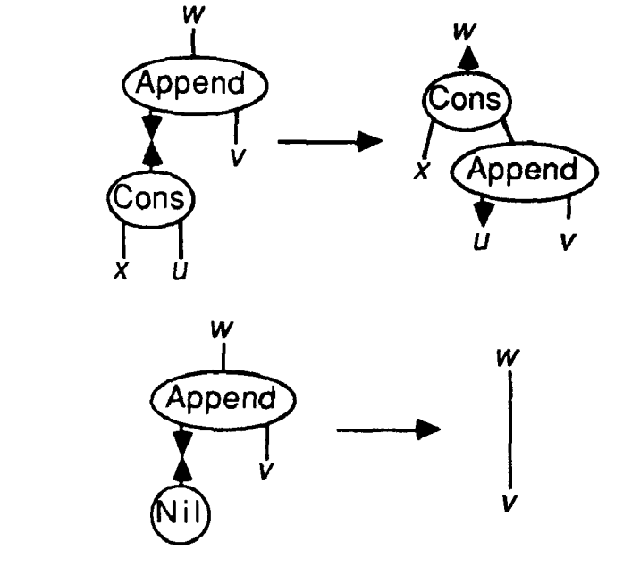
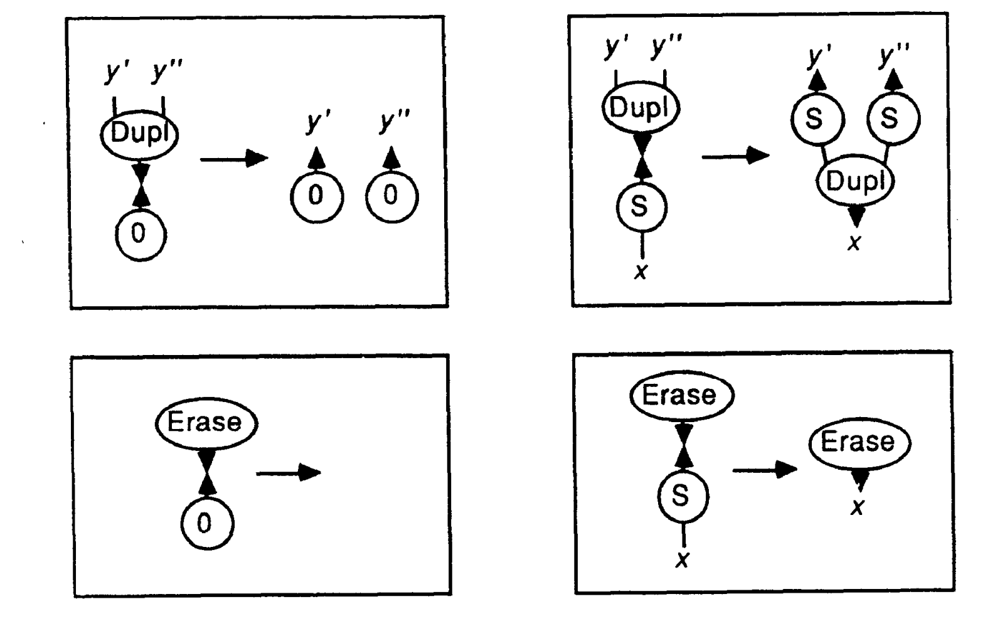
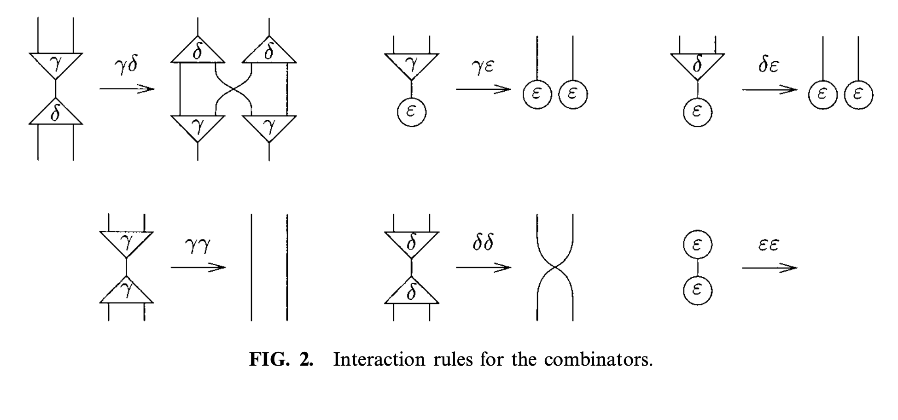
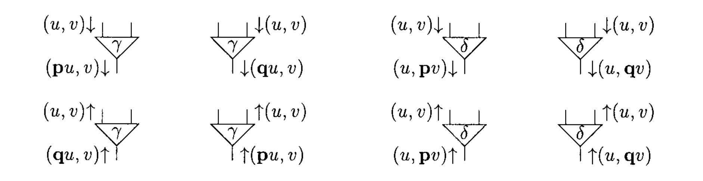
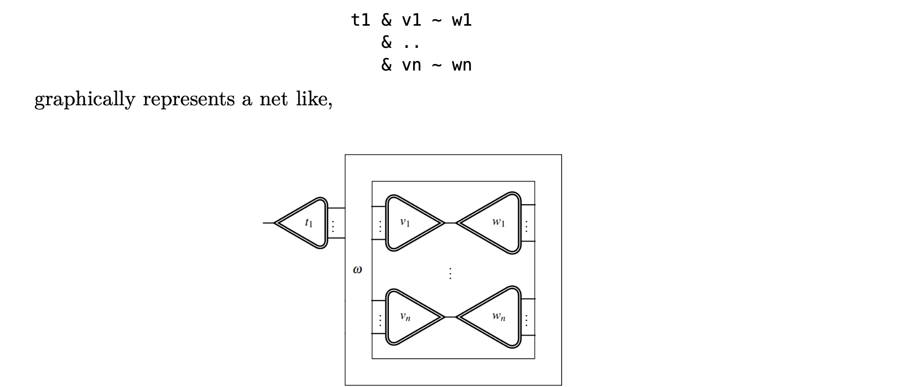
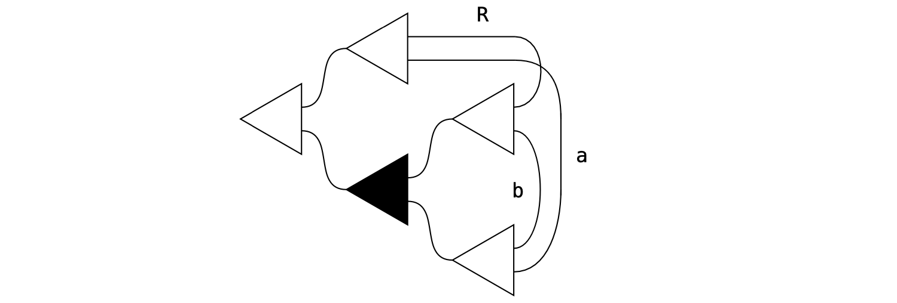
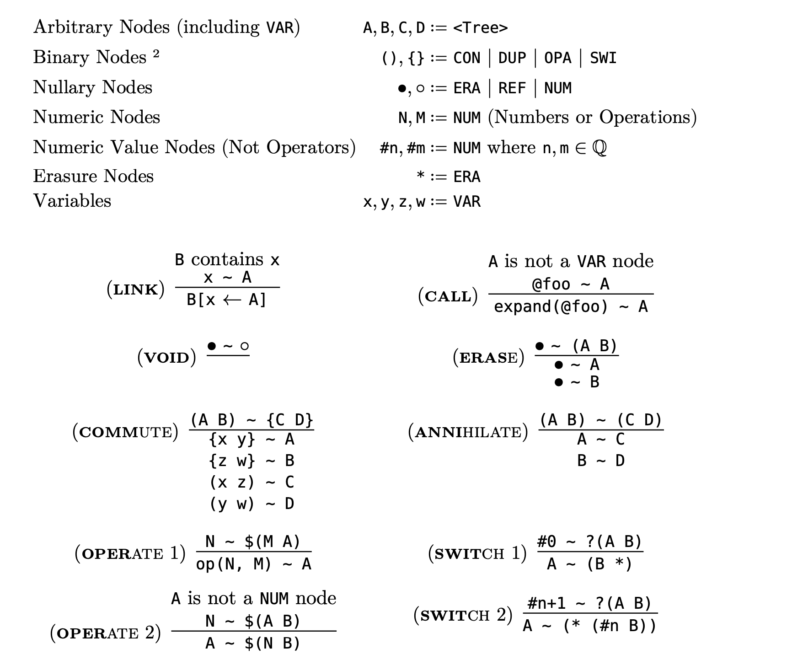

# Parallelism for Free? Understanding interaction combinators and the Bend programming language

Bend is a programming language, developed by HigherOrderCo (HOC), that 
claims that any code you write that _can_ be parallelized,
_will_ be parallelized, even if you haven't written it 
specifically with a parallel execution in mind. How does 
it do this?

The main idea is this: Bend runs on the Higher-Order Virtual Machine
(HVM), also developed by HOC, which uses a bytecode that implements
something called the "Interaction Calculus." Interaction calculus is a 
Turing-complete computation system (just like Lambda calculus) with
a property called _strong confluence_ which implies that reductions
can be done in parallel in a consistent manner. Because Bend 
compiles down to this bytecode, the HVM can then perform reductions
on the bytecode in parallel, which gives Bend its (theoretical) 
speedup.

So how does this all work?

## Interaction nets and Interaction combinators
Interaction nets are a graph rewriting system invented by 
Yves Lafont in 1990. The system is represented by a graph
where vertices are called _agents_ and the edges between them
are called _wires_. Each agent has a fixed _arity_, n, and 
an agent of arity n has n+1 _ports_. The extra port is special 
and is called the _principal port_. Agents only 
_interact_ through their principal ports. All the other ports are 
called _auxiliary ports_



This system is just a base, and on top of this you can add 
_rewrite rules_ that determine how interacting pairs reduce.
An important restriction on any reduction rules that must be followed
by any system is that for each reduction rule
any _variable_ must occur exactly once  on each side of the rule.
We can still duplicate and erase data, but it needs to be done
explicitly. In the HVM implementation, the eraser node _is_ the 
garbage collector and _no separate garbage collection is needed!_



These conditions are already enough to give us the property that makes these things
useful: strong confluence. If a net A reduces to B and B' in one step, then both 
B and B' reduce to a common C in one step. Because agents only interact through 
their principal ports, and each agent only has one, two rules cannot interfere with 
each other. This implies that the _order_ of reductions doesn't matter and interactions 
can be performed concurrently. In particular, _if_ a given net X reduces to an irreducible 
net Y after n reductions, then any order of doing those n reductions will give you the net 
Y (of course, this only applies if the reductions terminate. Proving that reductions
will terminate to an irreducible net, given a starting net, is of course impossible).
This is what gives this system all its power!

Till now, I have just described the graph-rewriting system of interaction nets. A 
specific implementation of them needs to supply its own reduction rules. Interaction 
combinators are one such implementation. The interaction combinator
system is a Turing-complete model of computation with only three symbols and 
six interaction rules.



The paper introducing interaction combinators goes into depth proving the 
universality of this system of rules. The gist of the argument is that they 
construct a way to express any interaction _net_ as a net of _combinators_ by 
using a sophisticated translation scheme. This still leaves us with only these 
abstract rules, without an interpretation for them. The simple interpretation of 
the combinators is that epsilon is the eraser, delta is the duplicator, and 
gamma is some form of "binary construction." Another interpretation is to 
consider the reduced net, which in the general case is just a permutation of 
wires, and send a "package" through the wires and see which wire it ends up at. 
Turns out, this can be computed even without reducing the nets (because the effect of 
each cell is deterministic) and gives the combinators and interpretation as a stack machine.





## HVM bytecode: representing this textually
This interaction combinator system I described above is more or less 
what HVM bytecode implements, with some additional fluff thrown in for 
optimization. The syntax for HVM bytecode is quite simple and looks like this:

```INF
 <Node> ::=
     | "*"                    -- (ERA)ser
     | "@" <alphanumeric>     -- (REF)erence
     | <Numeric>              -- (NUM)eric
     | "(" <Tree> <Tree> ")"  -- (CON)structor
     | "{" <Tree> <Tree> "}"  -- (DUP)licator
     | "$(" <Tree> <Tree> ")" -- (OPE)rator
     | "?(" <Tree> <Tree> ")" -- (SWI)tch
 <Tree> ::=
     | <alphanumeric>         -- (VAR)iable
     | <Node>
 <alphanumeric> ::= [a-zA-Z0-9_.-/]
```

In these, ERA, CON and DUP are the original interaction combinator 
nodes and act exactly like they did in that system. NUM, OPE and SWI nodes 
are for numeric computation and switches, for optimization purposes. A REF 
represents a function call, and has the purpose of allowing naming of 
nets. A VAR is a named connection between two auxiliary ports.

Nodes are connected through wirings or principal ports. An active
(principal-principal) connection is written with a "~". An aux-aux
connection is _named_ with a variable, and an aux-prin connection is 
implicit. Redexes (active connections) are separated with an "&".



The tree `({(a b) (b R)} (a R))` represents the net:



The reduction rules are:



Of these, VOID, ERASE, COMMUTE, and ANNIHILATE are the interaction combinator 
rules, OPERATE and SWITCH are for performing low-level computation (instead of 
dealing with Church numerals), CALL expands a reference into its net, and 
LINK links up the _wire_ x with the principal port of A. All-in-all, this is a 
pretty faithful adaptation of the original rules, with four rules added for 
computation (but which don't alter semantics) and two rules added for 
memory-layout reasons (which also don't alter semantics).

The basic HVM algorithm is to have a pool of active nodes, which are 
then reduced one-at-a-time by threads. There are some issues with wire-reductions
in the LINK step, but other than that the whole system follows strong confluence and 
can be sped-up using parallelization.


## Bend syntax and features
Now that we understand how the underlying system works, it's time to 
understand how Bend translates programs to this interaction calculus
layer. Before we can do that, we need to be able to read programs written
in Bend. Thankfully, Bend syntax isn't that hard to understand. It emulates 
python for the most part, though it _is_ a purely functional language with
no mutation (there's also _another_ LISP-like syntax with worse documentation. I 
decided to stick with the pythonic syntax because I can only cover one of them
and the python syntax is better documented).
It also has _affine types_, which means there is also some
syntax for move semantics (the "open" keyword) and discarding
(which bend calls "erasing")

Most of the syntax is very basic: function definitions, if-else blocks,
struct declarations (here are only three datatypes (u24, i24, f24) and some ways
of combining those into larger structures), lambdas, and the "fork" and "bend" keywords
which need a little bit of explaining. Many of the examples below are from the Bend
project repository.

A program enters at main. There is no IO, but the 
return value of main is printed to stdout at the end. Function definitions
and lambdas works as expected.

```py
def main:
  sum = add(2, 3)
  return sum

# These two are equivalent
def add(x, y):
  return x + y

def add2:
  return lambda x, y: x + y

```

Data types (which are algebraic) can be made:

```py
# With a tuple
def tuple_fst(x):
  # This destructures the tuple into the two values it holds.
  # '*' means that the value is discarded and not bound to any variable.
  (fst, *) = x
  return fst

# With an object (similar to what other languages call a struct, a class or a record)
object Pair { fst, snd }

def Pair/fst(x):
  match x:
    case Pair:
      return x.fst

# We can also access the fields of an object after we `open` it.
def Pair/fst_2(x):
  open Pair: x
  return x.fst

# This is how we can create new objects.
def Pair/with_one(x):
  return Pair{ fst: x, snd: 1 }

# The function can be named anything, but by convention we use Type/function_name.
def Pair/swap(x):
  open Pair: x
  # We can also call the constructor like any normal function.
  return Pair(x.snd, x.fst)

type MyTree:
  Node { val, ~left, ~right }
  Leaf


```

In the above example, "open" is used to bring the fields of an 
object into scope and is a move semantic to maintain the "affine-ness" of
a type. The asterisk "*" is called an eraser and discards the type. The
"~" in the definition of trees indicates a recursive data type.

Pattern matching works exactly as expected:

```py
def Maybe/or_default(x, default):
  match x:
    case Maybe/Some:
      # We can access the fields of the variant using 'matched.field'
      return x.val
    case Maybe/None:
      return default
```

There are literals for lists, maps, and trees (the exclamation
marks in the list-like structure make it a tree. It needs to be 
put before the integer literals too, to wrap them in a Tree/Leaf)

```py 
[1,2,3,4]
{'a':'z', 'b':'y'}
![![!1, !2], !3]
```

There are two related keywords: fold and bend. Fold consumes a 
recursive datatype, recursively replacing its self-similar
fields with a computation, and bend does the opposite, _creating_
a recursive datatype by replacing steps in the creation recursively.
Ultimately they are both just sugar to avoid writing boilerplate
recursive functions to create and consume recursive datatypes.

```py
def MyTree.sum(x):
  # Sum all the values in the tree.
  fold x:
    # The fold is implicitly called for fields marked with '~' in their definition.
    case MyTree/Node:
      return x.val + x.left + x.right
    case MyTree/Leaf:
      return 0

def main:
  bend val = 0:
    when val < 10:
      # 'fork' calls the bend recursively with the provided values.
      x = MyTree/Node { val:val, left:fork(val + 1), right:fork(val + 1) }
    else:
      # 'else' is the base case, when the condition fails.
      x = MyTree/Leaf

  return MyTree.sum(x)
```

You can also do accumulators with fold (making it basically
what a fold would mean in most functional languages)

```py
# This function substitutes each value in the tree with the sum of all the values before it.
def MyTree.map_sum(x):
  acc = 0
  fold x with acc:
    case MyTree/Node:
      # `x.left` and `x.right` are called with the new state value.
      # Note that values are copied if you use them more than once, so you don't want to pass something very large.
      return MyTree/Node{ val: x.val + acc, left: x.left(x.val + acc), right: x.right(x.val + acc) }
    case MyTree/Leaf:
      return x
```

There are some other subtleties, like duplications and 
superpositions, or scopeless lambdas, that I will get to 
in the next section. They are just the hvm implementation
leaking out into the language, but in some cases this 
leaking is really interesting.


## Bend under the hood 
Let's look at the transformation of Bend structures to HVM code. Starting off, we have 

```py 
def main():
  return 5
```
 ```
@main = 5
```

This introduces us to the basic structure of an HVM program. 
Each program must have one `@main` ref node, and the value of 
that node, once reduced, is the output of the program.

```py 
def main():
  return 1+2
```

```
@main = a
  & $(2 a) ~ [+0x0000001]
```

Okay, this is a little more complicated. The [+0x000001] is the 
add-one operator, which is connected through a principal port to 
an operator block that holds a 2, and a wire to main. Upon reduction
through the OP rule this becomes

```
@main = a 
  & (2 a)
```

which then reduces to `@main = 2` through the LINK rule. Now let's have 
a look at how functions are compiled:


```py 
def main():
  return add(3, 5)

def add(x,y):
  return x+y


```

```
@add = ($([+] $(a b)) (a b))

@main = a
  & @add ~ (3 (5 a))

```

This exposes the structure of HVM bytecode files more. In general,
a Bytecode file is in the form of a _book_, with a bunch of top-level 
REF definitions ending in main. We also see function-calling. The cool 
thing about function calling in interaction nets is that it's simply 
connecting the argument to the principal port of the function net! This 
also preserves the lambda-calculus-like currying nature of functions, because 
every function is in truth unary and produces further curried functions.

The ref definitions are most often 
functions, but as we will see they can be other things too. Let's compile 
the following fragment, which also appeared in the syntax section.

```py 

# With a tuple
def tuple_fst(x):
  # This destructures the tuple into the two values it holds.
  # '*' means that the value is discarded and not bound to any variable.
  (fst, *) = x
  return fst

# With an object (similar to what other languages call a struct, a class or a record)
object Pair { fst, snd }

def Pair/fst(x):
  match x:
    case Pair:
      return x.fst

# We can also access the fields of an object after we `open` it.
def Pair/fst_2(x):
  open Pair: x
  return x.fst

# This is how we can create new objects.
def Pair/with_one(x):
  return Pair{ fst: x, snd: 1 }

# The function can be named anything, but by convention we use Type/function_name.
def Pair/swap(x):
  open Pair: x
  # We can also call the constructor like any normal function.
  return Pair(x.snd, x.fst)

type MyTree:
  Node { val, ~left, ~right }
  Leaf

def main():
  return MyTree/Node (0, MyTree/Leaf(1), MyTree/Leaf(2))

```

```
@MyTree/Leaf = ((@MyTree/Leaf/tag a) a)

@MyTree/Leaf/tag = 1

@MyTree/Node = (a (b (c ((@MyTree/Node/tag (a (b (c d)))) d))))

@MyTree/Node/tag = 0

@Pair = (a (b ((@Pair/tag (a (b c))) c)))

@Pair/fst = ((@Pair/fst__C0 a) a)

@Pair/fst_2 = ((@Pair/fst_2__C0 a) a)

@Pair/fst_2__C0 = (?(((a (* a)) *) b) b)

@Pair/fst__C0 = (?(((a (* a)) *) b) b)

@Pair/swap = ((@Pair/swap__C1 a) a)

@Pair/swap__C0 = (b (a c))
  & @Pair ~ (a (b c))

@Pair/swap__C1 = (?((@Pair/swap__C0 *) a) a)

@Pair/tag = 0

@Pair/with_one = (a b)
  & @Pair ~ (a (1 b))

@main = c
  & @MyTree/Node ~ (0 (a (b c)))
  & @MyTree/Leaf ~ (1 a)
  & @MyTree/Leaf ~ (2 b)

@tuple_fst = ((a *) a)

```

We now have some more REF tags, mostly to refer to inner members of 
structs of different variants of structs. One interesting feature to note 
is the `fun__C0` pattern - it refers to the first member of an `open`ed 
struct and erases the other member of the struct to preserve 
affine-ness.

Let's look at how the `fork` and `bend` keywords are compiled:

```py 
def MyTree.sum(x):
  # Sum all the values in the tree.
  fold x:
    # The fold is implicitly called for fields marked with '~' in their definition.
    case MyTree/Node:
      return x.val + x.left + x.right
    case MyTree/Leaf:
      return 0

def main:
  bend val = 0:
    when val < 10:
      # 'fork' calls the bend recursively with the provided values.
      x = MyTree/Node { val:val, left:fork(val + 1), right:fork(val + 1) }
    else:
      # 'else' is the base case, when the condition fails.
      x = MyTree/Leaf

  return MyTree.sum(x)
```

```
@MyTree.sum = (a b)
  & @MyTree.sum__fold0 ~ (a b)

@MyTree.sum__fold0 = ((@MyTree.sum__fold0__C1 a) a)

@MyTree.sum__fold0__C0 = ($([+] $(b $([+] $(d e)))) (a (c e)))
  &!@MyTree.sum__fold0 ~ (a b)
  &!@MyTree.sum__fold0 ~ (c d)

@MyTree.sum__fold0__C1 = (?((@MyTree.sum__fold0__C0 (* 0)) a) a)

@MyTree/Leaf = ((@MyTree/Leaf/tag a) a)

@MyTree/Leaf/tag = 1

@MyTree/Node = (a (b (c ((@MyTree/Node/tag (a (b (c d)))) d))))

@MyTree/Node/tag = 0

@main = b
  & @MyTree.sum ~ (a b)
  & @main__bend0 ~ (0 a)

@main__bend0 = ({$([>0x000000A] ?(((* @MyTree/Leaf) @main__bend0__C0) (a b))) a} b)

@main__bend0__C0 = (* ({a {$([+0x0000001] b) $([+0x0000001] d)}} f))
  & @MyTree/Node ~ (a (c (e f)))
  &!@main__bend0 ~ (b c)
  &!@main__bend0 ~ (d e)

```

They are actually just inline functions that do the recursive folding/bending.

Now that we've looked at how the basic bend constructs are compiled, let's end this section by 
looking at lambdas. Bend has two varieties of lambdas, scoped and scopeless. Scoped lambdas behave 
exactly as normal lambdas do (with some subtleties about lazy evaluation; the HVM has a lazy and a strict 
evaluation mode).

```py 
def main():
  return add(2,3)

def add():
  return lambda x, y: x+y

```

```
@add = ($([+] $(a b)) (a b))

@main = a
  & @add ~ (2 (3 a))

```

This compiles to exactly the same structure as a normal def. Indeed, in 
Bend _all_ defs are just sugar for lambdas. It also does automatic currying/
uncurrying:

```py 
def main():
  return add(2,3)

def add(x):
  return lambda y: x+y

```
```
@add = ($([+] $(a b)) (a b))

@main = a
  & @add ~ (2 (3 a))
```

Unnamed lambdas get compiled as such:

```py 
def main():
  return (lambda x, y: x+y)(2,3)

```
```
@main = c
  & ($([+] $(a b)) (a b)) ~ (2 (3 c))

```

In general, lambdas are treated exactly like functions, and get compiled as such. 
Named functions are still more powerful, though, because you can explicitly 
recurse:

```py 
def fac(n):
  if n > 1:
    return n*fac(n - 1)
  else:
    return 1

def main():
  return fac(5)
```

```
@fac = ({$([<0x0000001] ?(((* 1) @fac__C0) (a b))) a} b)

@fac__C0 = (* ({$([*] $(b c)) $([:-0x0000001] a)} c))
  & @fac ~ (a b)

@main = a
  & @fac ~ (5 a)
```
There are interesting memory implications to recursion, because 
each time a function is called the entire function net is copied and 
inlined. Finally, let's look at scopeless lambdas. To make a variable 
"scopeless", we just prefix "$" to its name. We can now use it outside 
the lambda it was defined in! The variable isn't truly scopeless because 
it only lasts within a single def (internally, REF) block.

```py
def scopeless():
  return (lambda $x: 1)(2) + $x

def scoped():
  return (lambda x: 1)(2) + 2

```
```
@scoped = a
  & (* 1) ~ (2 $([+0x0000002] a))

@scopeless = b
  & (a 1) ~ (2 $([+] $(a b)))

```

The "scopeless" variable is just the wire "a", which now detaches from 
the net that represents the lambda and fits into the outside computation. In 
this sense, scopeless variables are very easy to represent internally in HVM. Another 
interesting thing to notice is the destructor waiting for the unused variable in the 
scoped version. 

There is something else interesting in the scopeless bytecode: The lambda term is 
just `(a 1)`, and the rest of the net is just... waiting for the result of the lambda.
It is a reified version of the "computation that will be done to the result of the lambda":
a continuation! Continuations aren't difficult to represent using interaction nets, because 
_every_ computation is reified into a net. Turns out, scopeless lambdas are exactly the tool 
that lets you "bring out" the continuation. The next example (from the Bend repo) uses Bend's 
functional syntax, because it is somewhat difficult to show the call/cc without it. It 
is very readable as just LISP:

```py
# Function that discards its second argument
Seq a b = a

# Create a program capable of using `callcc`
CC.lang = λprogram
  let callcc  = λcallback (λ$garbage($hole) (callback λ$hole(0)));
  let result  = (program callcc);
  (Seq result $garbage)

Main = (CC.lang λcallcc 
  # This code calls `callcc`, then calls `k` to fill the hole with `42`. This means that the call to callcc returns `42`, and the program returns `52`. (+ (k 42) 1729) is garbage and is erased.
  (+ 10 (callcc λk(+ (k 42) 1729)))
)
```

```
@CC.lang = (((((a 0) b) c) d) f)
  & @Seq ~ (d (e f))
  & (e a) ~ (b c)

@Seq = (a (* a))

@main = d
  & @CC.lang ~ (((((42 $([+0x00006C1] a)) a) b) c) d)
  & $(b c) ~ [+0x000000A]
```

The explanation behind this is that using a scopeless lambda, we 
can "expose" the hole variable to the outer computation, and when 
`(k 42)` is called that binds 42 to the hole which is then added 
to 10. Most of the complication arises from the need to _implicitly_ 
pass around hole (because the variable name doesn't bind across definitions)
and the fact that Bend is affine so you can throw away the garbage.


## Wrapping up: Does Bend do what it promises?

Bend is still deeply experimental. Its current implementation
is not very well optimized, execution can be different (and buggy!)
based on which interpreter (Rust, C, or CUDA) you use, and it doesn't 
yet support IO! Still, Bend is the only implementation of the interaction
combinator idea I could find, and in some hand-picked examples it does have 
immense speedup over (say) GHC. In some sense, its promise of "what
_can_ be parallelized, _will_" be parallelized is true because at any 
stage of the reduction HVM can try to perform all possible current reductions 
at the same time. However, if the algorithm written is itself sequential, 
the bytecode will be bottlenecked and no amount of extra threads would be able 
to speed the graph reductions. Since the project is in its early phases, some static-time 
optimizations would also probably help with producing the right kind of parallel-reducible bytecode.

## References

- Yves Lafont, _Interaction nets_
- Yves Lafont, _Interaction Combinators_
- Victor Taelin, _HVM2: A Parallel evaluator for interaction combinators_
- [The Bend github repo](https://github.com/HigherOrderCO/Bend/)
- [The HVM github repo](https://github.com/HigherOrderCO/HVM/)
